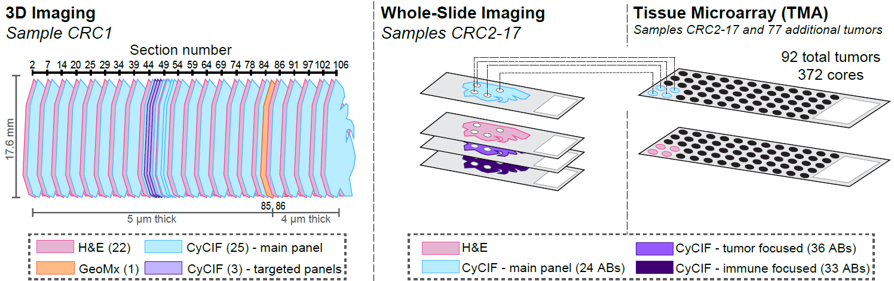

[](https://opensource.org/licenses/MIT)
# Multiplexed 3D atlas of state transitions and immune interaction in colorectal cancer 
<br>
Jia-Ren Lin*, Shu Wang*, Shannon Coy*, Yu-An Chen, Clarence Yapp, Madison Tyler, Maulik K. Nariya, Cody N. Heiser, Ken S. Lau, Sandro Santagata†, and Peter K. Sorger†

*These (first) authors contributed equally<br>
†These (senior) authors contributed equally<br>

**DOI:** [10.1016/J.CELL.2022.12.028](https://doi.org/10.1016/J.CELL.2022.12.028)  
**Learn more:** [tissue-atlas.org/atlas-datasets/lin-wang-coy-2021/](https://www.tissue-atlas.org/atlas-datasets/lin-wang-coy-2021/)  

<br>

<br>


## SUMMARY
Advanced solid cancers are complex assemblies of tumor, immune, and stromal cells characterized by high intratumoral variation. We use highly multiplexed tissue imaging, 3D reconstruction, spatial statistics, and machine learning to identify cell types and states underlying morphological features of known diagnostic and prognostic significance in colorectal cancer. Quantitation of these features in high-plex marker space reveals recurrent transitions from one tumor morphology to the next, some of which are coincident with long-range gradients in the expression of oncogenes and epigenetic regulators. At the tumor invasive margin, where tumor, normal, and immune cells compete, T-cell suppression involves multiple cell types and 3D imaging shows that seemingly localized 2D features such as tertiary lymphoid structures are commonly interconnected and have graded molecular properties. Thus, while cancer genetics emphasizes the importance of discrete changes in tumor state, whole-specimen imaging reveals large-scale morphological and molecular gradients analogous to those in developing tissues.
<br>

## View image data online
Some data is available as narrated data explorations (with text and audio narration) for anonymous on-line browsing using MINERVA software (Rashid et al., 2022), which allows users to pan and zoom through the images without requiring any software installation. 

**To view the Minerva stories, please visit [tissue-atlas.org/atlas-datasets/lin-wang-coy-2021/#data-explorations](https://www.tissue-atlas.org/atlas-datasets/lin-wang-coy-2021/#data-explorations).**  


## Access the Full Dataset
All images at full resolution, derived image data (e.g., segmentation masks), and cell count tables have been released via the NCI-sponsored repository for Human Tumor Atlas Network (HTAN; [humantumoratlas.org/explore](https://humantumoratlas.org/explore)). Because the public resource is still undergoing extensive development, an additional version of the data is temporarily available at https://labsyspharm.github.io/HTA-CRCATLAS-1/data.html.
The full 2.3 TB dataset with all 47 images is available through Amazon Web Services S3 at the following locations: 

```text
s3://htan-tnp-sardana-hms-prerelease/phase-1/data/
s3://htan-tnp-sardana-hms-prerelease/phase-1/metadata/
```

*Email tissue-atlas(at)hms.harvard.edu with the subject line "CRC: Data Access" if you experience issues accessing the above S3 buckets.*

To browse and download the data use either a graphical file transfer application that supports S3 such as [CyberDuck](https://cyberduck.io/), or the [AWS CLI](https://aws.amazon.com/cli/) tools. A graphical tool may be more convenient but the CLI tools will likely offer higher download speeds.

**The following table contains summary biospecimen and file metadata for all 47 sections.** 

|Section|Internal_Biospecimen_ID|Method |Thickness (μm)|Size (GB)|Image Filename      |Metadata Filename        |
|-------|-----------------------|-------|---------------|---------|--------------------|-------------------------|
|1      |WD-76845-001           |H&E    |5              |12.2     |WD-76845-001.ome.tif|WD-76845-001-metadata.csv|
|2      |WD-76845-002           |t-CyCIF|5              |88       |WD-76845-002.ome.tif|WD-76845-002-metadata.csv|
|6      |WD-76845-006           |H&E    |5              |11       |WD-76845-006.ome.tif|WD-76845-006-metadata.csv|
|7      |WD-76845-007           |t-CyCIF|5              |80.2     |WD-76845-007.ome.tif|WD-76845-007-metadata.csv|
|13     |WD-76845-013           |H&E    |5              |11.9     |WD-76845-013.ome.tif|WD-76845-013-metadata.csv|
|14     |WD-76845-014           |t-CyCIF|5              |72.4     |WD-76845-014.ome.tif|WD-76845-014-metadata.csv|
|19     |WD-76845-019           |H&E    |5              |12.7     |WD-76845-019.ome.tif|WD-76845-019-metadata.csv|
|20     |WD-76845-020           |t-CyCIF|5              |83.6     |WD-76845-020.ome.tif|WD-76845-020-metadata.csv|
|24     |WD-76845-024           |H&E    |5              |11       |WD-76845-024.ome.tif|WD-76845-024-metadata.csv|
|25     |WD-76845-025           |t-CyCIF|5              |83.6     |WD-76845-025.ome.tif|WD-76845-025-metadata.csv|
|28     |WD-76845-028           |H&E    |5              |10.1     |WD-76845-028.ome.tif|WD-76845-028-metadata.csv|
|29     |WD-76845-029           |t-CyCIF|5              |74.4     |WD-76845-029.ome.tif|WD-76845-029-metadata.csv|
|33     |WD-76845-033           |H&E    |5              |11.8     |WD-76845-033.ome.tif|WD-76845-033-metadata.csv|
|34     |WD-76845-034           |t-CyCIF|5              |82.2     |WD-76845-034.ome.tif|WD-76845-034-metadata.csv|
|38     |WD-76845-038           |H&E    |5              |11.3     |WD-76845-038.ome.tif|WD-76845-038-metadata.csv|
|39     |WD-76845-039           |t-CyCIF|5              |80.2     |WD-76845-039.ome.tif|WD-76845-039-metadata.csv|
|43     |WD-76845-043           |H&E    |5              |11       |WD-76845-043.ome.tif|WD-76845-043-metadata.csv|
|44     |WD-76845-044           |t-CyCIF|5              |76.6     |WD-76845-044.ome.tif|WD-76845-044-metadata.csv|
|48     |WD-76845-048           |H&E    |5              |11.2     |WD-76845-048.ome.tif|WD-76845-048-metadata.csv|
|49     |WD-76845-049           |t-CyCIF|5              |76.6     |WD-76845-049.ome.tif|WD-76845-049-metadata.csv|
|50     |WD-76845-050           |t-CyCIF|5              |80.2     |WD-76845-050.ome.tif|WD-76845-050-metadata.csv|
|51     |WD-76845-051           |t-CyCIF|5              |76.6     |WD-76845-051.ome.tif|WD-76845-051-metadata.csv|
|52     |WD-76845-052           |t-CyCIF|5              |80.2     |WD-76845-052.ome.tif|WD-76845-052-metadata.csv|
|53     |WD-76845-053           |H&E    |5              |10.5     |WD-76845-053.ome.tif|WD-76845-053-metadata.csv|
|54     |WD-76845-054           |t-CyCIF|5              |74.5     |WD-76845-054.ome.tif|WD-76845-054-metadata.csv|
|58     |WD-76845-058           |H&E    |5              |10.5     |WD-76845-058.ome.tif|WD-76845-058-metadata.csv|
|59     |WD-76845-059           |t-CyCIF|5              |80.2     |WD-76845-059.ome.tif|WD-76845-059-metadata.csv|
|63     |WD-76845-063           |H&E    |5              |10.5     |WD-76845-063.ome.tif|WD-76845-063-metadata.csv|
|64     |WD-76845-064           |t-CyCIF|5              |74.4     |WD-76845-064.ome.tif|WD-76845-064-metadata.csv|
|68     |WD-76845-068           |H&E    |5              |10.1     |WD-76845-068.ome.tif|WD-76845-068-metadata.csv|
|69     |WD-76845-069           |t-CyCIF|5              |69.5     |WD-76845-069.ome.tif|WD-76845-069-metadata.csv|
|73     |WD-76845-073           |H&E    |5              |9.1      |WD-76845-073.ome.tif|WD-76845-073-metadata.csv|
|74     |WD-76845-074           |t-CyCIF|5              |69.5     |WD-76845-074.ome.tif|WD-76845-074-metadata.csv|
|77     |WD-76845-077           |H&E    |5              |10.5     |WD-76845-077.ome.tif|WD-76845-077-metadata.csv|
|78     |WD-76845-078           |t-CyCIF|5              |69.5     |WD-76845-078.ome.tif|WD-76845-078-metadata.csv|
|83     |WD-76845-083           |H&E    |5              |9.6      |WD-76845-083.ome.tif|WD-76845-083-metadata.csv|
|84     |WD-76845-084           |t-CyCIF|5              |69.5     |WD-76845-084.ome.tif|WD-76845-084-metadata.csv|
|85     |WD-76845-085           |H&E    |4              |10.6     |WD-76845-085.ome.tif|WD-76845-085-metadata.csv|
|86     |WD-76845-086           |t-CyCIF|4              |72.4     |WD-76845-086.ome.tif|WD-76845-086-metadata.csv|
|90     |WD-76845-090           |H&E    |4              |9.9      |WD-76845-090.ome.tif|WD-76845-090-metadata.csv|
|91     |WD-76845-091           |t-CyCIF|4              |72.4     |WD-76845-091.ome.tif|WD-76845-091-metadata.csv|
|96     |WD-76845-096           |H&E    |4              |10.6     |WD-76845-096.ome.tif|WD-76845-096-metadata.csv|
|97     |WD-76845-097           |t-CyCIF|4              |74.5     |WD-76845-097.ome.tif|WD-76845-097-metadata.csv|
|101    |WD-76845-101           |H&E    |4              |10.5     |WD-76845-101.ome.tif|WD-76845-101-metadata.csv|
|102    |WD-76845-102           |t-CyCIF|4              |72.4     |WD-76845-102.ome.tif|WD-76845-102-metadata.csv|
|105    |WD-76845-105           |H&E    |4              |9.6      |WD-76845-105.ome.tif|WD-76845-105-metadata.csv|
|106    |WD-76845-106           |t-CyCIF|4              |69.5     |WD-76845-106.ome.tif|WD-76845-106-metadata.csv|


## Funding
This work was supported by NIH grants U54-CA225088 (PKS, SS), U2C-CA233280 (PKS, SS), U2C-CA233262 (PKS, SS), U2C-CA233291 (CNH, KSL), R01-DK103831 (CNH, KSL), NIH training grant T32-GM007748 (SC), and the Ludwig Center at Harvard (PKS, SS). All HTAN consortium members are named at humantumoratlas.org. Development of computational methods was supported by the Ludwig Cancer Research, by a Team Science Grant from the Gray Foundation, and by the David Liposarcoma Research Initiative. We thank Dana-Farber/Harvard Cancer Center for the use of the Specialized Histopathology Core, which provided histopathology services supported by P30-CA06516. 
<br>
